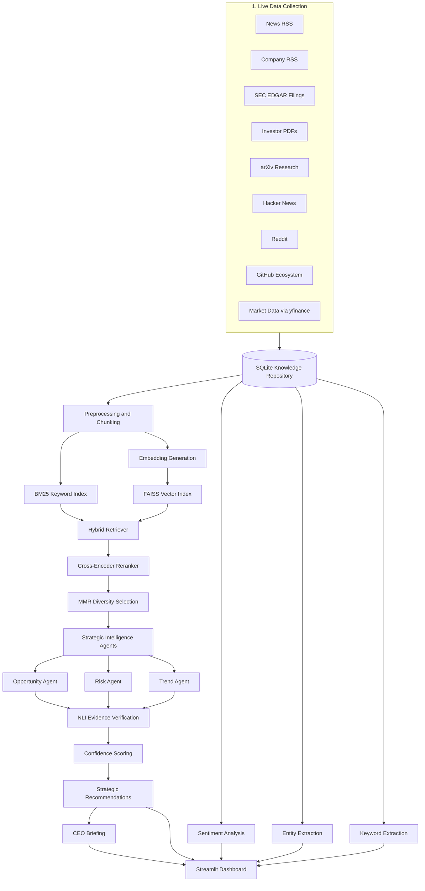

# ARCHITECTURE.md — AI CEO Strategic Intelligence Agent

## 1. Project purpose

The **AI CEO Strategic Intelligence Agent** is an evidence-grounded strategic intelligence system for a selected public company.  
The default company is **NVIDIA Corporation (NVDA)**.

The system collects live public information, stores it in a searchable knowledge repository, retrieves relevant evidence, analyzes business implications, verifies claims, and produces CEO-level strategic recommendations.

The final goal is to answer:

> **If you were the CEO today, what would you do next and why?**

This project is not only a news summarizer.  
It is a full NLP/RAG-based decision-support pipeline that transforms public information into strategic business insight.

---

## 2. High-level architecture



---

## 3. Data flow

```text
Public Sources
    ↓
Live Collection
    ↓
SQLite Repository
    ↓
Cleaning + Deduplication
    ↓
Chunking + Lemmatization
    ↓
BM25 Keyword Index + FAISS Vector Index
    ↓
Hybrid Retrieval
    ↓
Reranking + MMR Diversity
    ↓
Local Open-Source LLM Reasoning
    ↓
NLI Verification
    ↓
Confidence Scoring
    ↓
Opportunities / Risks / Trends
    ↓
Strategic Recommendations
    ↓
CEO Briefing
    ↓
Streamlit Dashboard
```

---

## 4. Main pipeline files

| File | Role |
|---|---|
| `collect.py` | Collects live public information from multiple sources |
| `database.py` | Stores documents, stock data, and metadata in SQLite |
| `preprocess.py` | Cleans text, removes duplicates, chunks documents, prepares text |
| `repository.py` | Builds BM25 + FAISS hybrid retrieval system |
| `sentiment.py` | Runs financial and public sentiment analysis |
| `entities.py` | Extracts organizations, competitors, and entity relationships |
| `keywords.py` | Extracts deterministic TF-IDF keywords |
| `intelligence.py` | Runs opportunity, risk, trend, recommendation, and CEO briefing logic |
| `llm.py` | Connects to local/free LLM backend such as Qwen through Ollama |
| `evaluate.py` | Evaluates retrieval quality using Hit@k and MRR |
| `refresh.py` | Runs the full pipeline end-to-end |
| `app.py` | Streamlit dashboard with 7 required pages plus extra analysis pages |

---

## 5. Public information sources

The project uses 9 independent source types.

| Source type | Example purpose |
|---|---|
| News RSS | Recent external market and industry news |
| Company RSS | NVIDIA official announcements |
| SEC EDGAR filings | Official financial and risk disclosures |
| Investor PDFs | Reports, investor presentations, quarterly material |
| arXiv research | Technical and AI research trends |
| Hacker News | Developer and technology community discussion |
| Reddit | Public/community sentiment |
| GitHub ecosystem | Open-source activity and developer ecosystem signals |
| yfinance | Stock prices and market indicators |

These sources provide a mix of:

```text
1. First-party official evidence
2. Third-party market evidence
3. Public/community sentiment evidence
4. Technical/research evidence
5. Financial/market evidence
```

This avoids relying on only one information source.

---

## 6. Knowledge repository

### Storage choice

The project uses **SQLite** as the main local knowledge repository.

### Why SQLite?

SQLite was chosen because:

```text
1. It is local and free.
2. It requires no server setup.
3. It is easy to inspect during the oral exam.
4. It supports accumulated data across multiple refreshes.
5. It works well for a one-week individual prototype.
```

### Stored information

The database stores:

```text
document title
document text
source type
URL
published date
collected timestamp
company relevance metadata
stock price history
market indicators
```

SQLite acts as the **source of truth** before documents are processed into retrieval chunks.

---

## 7. Preprocessing design

The preprocessing stage prepares raw collected documents for retrieval and analysis.

### Main preprocessing steps

```text
1. Clean noisy text
2. Remove very short or irrelevant documents
3. Normalize whitespace
4. Remove duplicate or near-duplicate content
5. Split documents into chunks
6. Lemmatize text for classical NLP
7. Save clean documents and chunks as JSON artifacts
```

### Why chunking is needed

Large documents cannot be passed fully to the LLM or retrieval model.  
Chunking splits long documents into smaller passages so the system can retrieve only the most relevant evidence.

### Chunking hyperparameters

| Hyperparameter | Value | Meaning |
|---|---:|---|
| Chunk size | `1000` characters/tokens depending on implementation | Approximate size of each retrieval passage |
| Chunk overlap | `150` | Repeated text between neighboring chunks to avoid losing context |
| Minimum document length | Project-defined threshold | Removes low-value short documents |
| Deduplication method | Content hash / normalized text | Prevents repeated articles from dominating retrieval |

### Why overlap is useful

Without overlap, important context may be split between two chunks.  
Overlap keeps part of the previous chunk inside the next chunk, improving retrieval quality.

---

## 8. Embedding model

### Model used

```text
BAAI/bge-small-en-v1.5
```

### Purpose

The embedding model converts text into numerical vectors.  
Similar meanings produce vectors that are close to each other.

Example:

```text
"export control risk for GPUs"
```

can retrieve a passage about:

```text
"restrictions on advanced semiconductor shipments"
```

even if the exact words are different.

### Why this model?

`BAAI/bge-small-en-v1.5` was chosen because:

```text
1. It is open-source/free.
2. It is small enough for CPU/laptop use.
3. It creates 384-dimensional embeddings.
4. It works well for semantic retrieval.
5. It avoids paid embedding APIs.
```

---

## 9. Vector index

### Vector index used

```text
FAISS
```

### FAISS purpose

FAISS stores embedding vectors and searches for the nearest vectors to a query.

In simple words:

```text
Query text → embedding vector → FAISS finds most similar document chunks
```

### Similarity method

The system uses cosine-like similarity by normalizing vectors and using inner product search.

| Component | Choice |
|---|---|
| Vector database | FAISS |
| Index type | `IndexFlatIP` |
| Similarity | Inner product over normalized vectors |
| Hosting | Local only |

### Why FAISS?

FAISS was chosen because:

```text
1. It is local and free.
2. It is fast for thousands of chunks.
3. It avoids hosted vector databases.
4. It is easy to rebuild during the exam.
5. It supports semantic search efficiently.
```

---

## 10. Keyword retriever

### Keyword retriever used

```text
BM25
```

### What BM25 does

BM25 is a classical keyword-based ranking algorithm.  
It scores documents based on how well query terms match document terms.

BM25 is good for:

```text
company names
stock tickers
technical terms
product names
exact phrases
competitor names
```

Example:

```text
Query: CUDA export restrictions
```

BM25 is useful because it strongly matches exact words such as:

```text
CUDA
export
restrictions
```

### Why not only embeddings?

Embeddings are good for semantic meaning, but sometimes they miss exact words.  
BM25 is better when the exact keyword matters.

---

## 11. Hybrid retrieval

The project combines:

```text
BM25 keyword retrieval + FAISS semantic retrieval
```

### Why hybrid search?

Hybrid search is stronger than using only one method.

| Retrieval method | Strength | Weakness |
|---|---|---|
| BM25 | Exact keywords, tickers, product names | Weak with synonyms |
| FAISS dense retrieval | Meaning and semantic similarity | Can miss exact keywords |
| Hybrid | Uses both | More reliable |

### Fusion hyperparameter

| Hyperparameter | Value |
|---|---:|
| BM25 / dense fusion alpha | `0.5` |

### Meaning of alpha

```text
alpha = 0.5
```

means the system gives balanced importance to:

```text
50% keyword score
50% semantic similarity score
```

If the professor asks how to tune it:

```text
Higher alpha toward BM25 = more exact keyword matching
Lower alpha toward FAISS = more semantic matching
```

---

## 12. Reranking

After initial retrieval, the system uses a reranker to improve the order of results.

### Why reranking is needed

Initial retrieval may return relevant-looking chunks, but not always in the best order.  
The reranker compares the query and each candidate passage more carefully.

### Simple explanation

```text
BM25/FAISS quickly find possible evidence.
The reranker decides which evidence is actually most relevant.
```

This improves the quality of the evidence passed to the LLM.

---

## 13. MMR diversity selection

### MMR means

```text
Maximal Marginal Relevance
```

### Purpose

MMR reduces repetition in retrieved evidence.

Without MMR, the top 5 results may all come from the same article.  
With MMR, the system prefers evidence that is both:

```text
1. Relevant to the question
2. Different from already selected evidence
```

### Why this matters for CEO recommendations

A CEO recommendation is stronger if it is supported by multiple independent sources, not five duplicate passages from the same document.

---

## 14. Strategic intelligence engine

The intelligence engine is implemented mainly in:

```text
intelligence.py
```

It contains several reasoning roles:

```text
1. Opportunity analyst
2. Risk analyst
3. Trend analyst
4. Recommendation generator
5. CEO briefing generator
```

### What the agents do

| Agent | Output |
|---|---|
| Opportunity Agent | New markets, product opportunities, partnerships, emerging technology openings |
| Risk Agent | Regulatory risks, supply chain issues, competition, sentiment risks |
| Trend Agent | Technology trends, market shifts, customer behavior shifts |
| Recommendation Generator | CEO-level actions with evidence and impact |
| CEO Briefing Generator | Executive summary: what happened, why it matters, what to do next |

---

## 15. LLM reasoning backend

### LLM used

```text
Qwen2.5-7B-Instruct via Ollama
```

### Why Qwen?

Qwen was chosen because:

```text
1. It is open/free.
2. It can run locally through Ollama.
3. It supports instruction-following.
4. It avoids paid APIs.
5. It satisfies the project constraint.
```

### Not used

The project does **not** use the following as the main reasoning engine:

```text
OpenAI API
Anthropic Claude API
Google Gemini API
Paid commercial LLM APIs
```

### LLM role

The LLM does not blindly answer from memory.  
It is prompted to use retrieved evidence from the knowledge base.

The LLM receives:

```text
retrieved passages
source titles
source URLs
task instruction
required output format
```

Then it generates:

```text
opportunities
risks
trends
recommendations
CEO briefing
```

---

## 16. RAG design

### What RAG means

```text
Retrieval-Augmented Generation
```

### Why RAG is used

The LLM alone may hallucinate.  
RAG reduces hallucination by forcing the LLM to use retrieved evidence.

### RAG flow

```text
User / analyst question
    ↓
Retrieve relevant evidence from BM25 + FAISS
    ↓
Pass evidence to local LLM
    ↓
Generate grounded answer
    ↓
Attach citations and confidence
```

### Simple oral exam explanation

> RAG means the model does not answer only from its internal memory.  
> First, it searches the project’s own knowledge base.  
> Then, it uses those retrieved documents as evidence to produce a grounded answer.

---

## 17. Evidence verification with NLI

### Model used

```text
facebook/bart-large-mnli
```

### What NLI means

```text
Natural Language Inference
```

NLI checks the relationship between:

```text
claim + evidence
```

It predicts whether the evidence:

```text
1. Supports the claim — entailment
2. Contradicts the claim — contradiction
3. Is unrelated or unclear — neutral
```

### Example

Claim:

```text
NVIDIA faces risk from export controls.
```

Evidence:

```text
The company disclosed that export restrictions may affect sales of advanced chips to some countries.
```

NLI result:

```text
Entailment: high
Contradiction: low
```

This means the evidence supports the claim.

### Why NLI is useful

NLI adds an independent verification layer after LLM generation.  
This helps detect unsupported or weak recommendations.

---

## 18. Confidence scoring

The system calculates confidence using:

```text
confidence = 0.50 * entailment + 0.25 * corroboration + 0.25 * freshness
```

### Components

| Component | Weight | Meaning |
|---|---:|---|
| Entailment | 0.50 | Does the evidence actually support the claim? |
| Corroboration | 0.25 | Is the claim supported by multiple sources? |
| Freshness | 0.25 | Is the evidence recent or still strategically valid? |

### Why entailment has the highest weight

Entailment is most important because even recent and multiple sources are not useful if they do not actually support the claim.

### Promotion rule for final CEO recommendations

Only strong findings should become final recommendations.

Recommended rule:

```text
verified == true
confidence >= 0.70
citations >= 3
source_types >= 2
```

Findings below this threshold should be shown as:

```text
Unverified Signals — Not Recommended for CEO Action Yet
```

---

## 19. Sentiment analysis

### Model used

```text
ProsusAI/finbert
```

### Why FinBERT?

FinBERT is trained for financial language.  
It is better than general sentiment models for business and market text.

### Sentiment outputs

The system calculates:

```text
news sentiment
public sentiment
sentiment by source
aspect-based sentiment
sarcasm/irony adjusted public sentiment
```

### Why sentiment matters

Sentiment helps the CEO understand how the market, public, and technical communities are reacting.

Examples:

```text
positive sentiment around AI demand
negative sentiment around regulation
mixed sentiment around valuation
```

---

## 20. Entity extraction

### Tool used

```text
spaCy NER + curated competitor/entity list
```

### Purpose

Entity extraction identifies important organizations, products, people, and competitors.

The dashboard uses this for:

```text
competitive landscape
organization mentions
competitor tracking
co-mention relationship graph
```

### Why curated tagging is added

General NER may miss company-specific entities such as:

```text
CUDA
GeForce
Blackwell
NVDA
```

So the project combines spaCy with manually curated business-relevant terms.

---

## 21. Keyword extraction

### Method used

```text
TF-IDF
```

### What TF-IDF means

```text
Term Frequency - Inverse Document Frequency
```

It finds terms that are important in the corpus but not common everywhere.

### Why TF-IDF is included

TF-IDF is deterministic and explainable.  
It supports the neural LLM pipeline with a classical NLP baseline.

---

## 22. Dashboard architecture

The dashboard is implemented using:

```text
Streamlit + Plotly
```

### Required 7 pages

The first seven pages exactly match the examination dashboard requirements.

| Page order | Page name |
|---:|---|
| 1 | Company Overview |
| 2 | Market Intelligence |
| 3 | Opportunity Monitor |
| 4 | Risk Monitor |
| 5 | Sentiment Analysis |
| 6 | Strategic Recommendations |
| 7 | CEO Briefing |

### Extra pages after required pages

Additional analysis pages are included after the required seven pages.

| Extra page | Purpose |
|---|---|
| Competitive Landscape | Shows competitors and links to what they are currently doing |
| Source Trust | Shows trust weighting and decision reliability of different sources |
| Ask the Agent | Allows live evidence-grounded Q&A using the indexed corpus |

### Why extra pages are after the required pages

The professor can immediately see the required structure first.  
Extra pages add value without confusing the grading rubric.

---

## 23. Dashboard page details

### 1. Company Overview

Displays:

```text
company name
industry
number of collected documents
number of data sources
last update timestamp
corpus by source
key terms
```

### 2. Market Intelligence

Displays:

```text
stock price chart
SMA50
SMA200
RSI
52-week high
52-week low
market trend
```

### 3. Opportunity Monitor

Displays:

```text
opportunity title
impact level
evidence
confidence score
verification status
corroboration level
```

### 4. Risk Monitor

Displays:

```text
risk title
risk category
severity level
evidence
confidence score
contested evidence if available
```

### 5. Sentiment Analysis

Displays:

```text
news sentiment
public sentiment
sentiment by source
aspect-based sentiment
sarcasm/irony adjusted public sentiment
```

### 6. Strategic Recommendations

Displays:

```text
recommendation
priority
supporting evidence
expected impact
risk level
addressed opportunity/risk/trend
```

### 7. CEO Briefing

Displays:

```text
what happened
why it matters
what management should do next
```

### 8. Competitive Landscape

Displays:

```text
known competitors by mentions
most-mentioned organizations
recent competitor activities
clickable source links
snippets explaining what competitors are doing
```

### 9. Source Trust

Displays:

```text
source trust level
source decision weight
source volume
internal vs external evidence
decision strategy chart
organization relationship graph
```

### 10. Ask the Agent

Displays:

```text
user question box
retrieved evidence
LLM-generated answer
citations
source links
```

---

## 24. Generated artifacts

The pipeline creates precomputed artifacts so the dashboard loads quickly.

Typical artifacts:

```text
data/clean/documents.json
data/clean/chunks.json
data/clean/intelligence.json
data/clean/sentiment.json
data/clean/entities.json
data/clean/keywords.json
data/clean/evaluation.json
data/clean/daily_brief.json
storage/ai_ceo.db
storage/faiss.index
storage/retriever.pkl
```

### Why precomputed artifacts are used

The dashboard should be fast during the exam.  
Heavy steps such as collection, embedding generation, and LLM reasoning are run before the demo using:

```bash
python refresh.py
```

The dashboard then reads the precomputed files.

---

## 25. Evaluation architecture

The project includes evaluation through:

```text
evaluate.py
```

### Evaluation metrics

| Metric | Meaning |
|---|---|
| Hit@k | Whether a relevant document appears in the top-k retrieved results |
| MRR | Mean Reciprocal Rank; rewards relevant documents appearing higher |
| Ablation | Compares retrieval modes such as BM25-only, FAISS-only, and hybrid |

### Why evaluation is needed

Evaluation proves that the retriever is not random.  
It shows whether the system can actually retrieve relevant evidence.

---

## 26. Important hyperparameters

| Hyperparameter | Value | Why it matters |
|---|---:|---|
| Chunk size | `1000` | Controls how much text goes into each retrieval unit |
| Chunk overlap | `150` | Preserves context between neighboring chunks |
| Embedding dimension | `384` | Output size of `bge-small-en-v1.5` |
| Hybrid alpha | `0.5` | Balances BM25 and FAISS scores |
| Confidence entailment weight | `0.50` | Gives strongest importance to evidence support |
| Confidence corroboration weight | `0.25` | Rewards multiple independent sources |
| Confidence freshness weight | `0.25` | Rewards recent or still-valid evidence |
| Recommendation threshold | `0.70` | Filters weak findings from final CEO recommendations |
| Required citations | `3` | Ensures evidence-based recommendation |
| Required source types | `2` | Avoids depending on only one type of evidence |
| LLM model | `Qwen2.5-7B-Instruct` | Open/free local reasoning model |
| Sentiment model | `ProsusAI/finbert` | Finance-domain sentiment classification |
| NLI model | `facebook/bart-large-mnli` | Evidence verification |

---

## 27. Alternatives considered

### SQLite vs PostgreSQL

| Option | Decision |
|---|---|
| SQLite | Chosen |
| PostgreSQL | Not chosen |

SQLite was better for this project because it is simpler, local, portable, and easier to demonstrate.

PostgreSQL would be better for a production system with multiple users and larger data.

---

### FAISS vs ChromaDB

| Option | Decision |
|---|---|
| FAISS | Chosen |
| ChromaDB | Not chosen |

FAISS was chosen because it is lightweight, local, and fast for the current project size.

ChromaDB would be useful if metadata filtering and vector database management were more important.

---

### Open-source LLM vs paid API

| Option | Decision |
|---|---|
| Qwen/Ollama | Chosen |
| OpenAI/Gemini/Claude API | Not allowed |

The project requirement forbids paid commercial LLM APIs as the primary reasoning engine, so the project uses a local/free model.

---

### Hybrid retrieval vs only semantic search

| Option | Decision |
|---|---|
| Hybrid BM25 + FAISS | Chosen |
| FAISS only | Not enough exact keyword matching |
| BM25 only | Not enough semantic understanding |

Hybrid retrieval gives better coverage across exact business terms and semantic concepts.

---

## 28. Strengths of the architecture

```text
1. Satisfies the open-source/free model constraint.
2. Collects from more than the minimum 3 required sources.
3. Uses local SQLite and FAISS, so no hosted database is needed.
4. Uses hybrid retrieval instead of only keyword search.
5. Adds NLI verification to reduce hallucination.
6. Produces evidence-based recommendations.
7. Dashboard follows the required 7-section structure.
8. Extra pages add value after the required pages.
9. Pipeline is explainable for oral examination.
10. Config-driven design supports live coding changes.
```

---

## 29. Limitations

```text
1. Some public sources may change format or block requests.
2. RSS feeds may not provide full article text.
3. Local LLM output quality depends on hardware and model availability.
4. NLI verification is useful but not perfect.
5. Community sentiment from Reddit/Hacker News can be noisy.
6. Stock movement does not always directly imply strategic meaning.
7. The current prototype is designed for one company at a time.
8. FAISS index must be rebuilt after major corpus changes.
```

---

## 30. Future improvements

```text
1. Add multi-company comparison mode.
2. Add scheduled GitHub Actions refresh.
3. Add stronger duplicate detection using embedding similarity.
4. Add better source reliability scoring.
5. Add downloadable PDF CEO briefing.
6. Add alert system for sudden risk changes.
7. Add time-series trend detection for opportunities and risks.
8. Add user feedback loop to approve or reject recommendations.
9. Add larger local LLM support on GPU.
10. Add dashboard authentication for production use.
```

---

## 31. Oral exam explanation script

Use this explanation if asked to summarize the architecture:

> My project is an AI CEO Strategic Intelligence Agent for NVIDIA.  
> It collects live public information from multiple sources such as news, company announcements, SEC filings, research, Reddit, Hacker News, GitHub, and market data.  
> The collected data is stored in SQLite. Then it is cleaned, deduplicated, and split into chunks.  
> Each chunk is indexed in two ways: BM25 for keyword retrieval and FAISS for semantic vector retrieval using the BAAI bge-small-en-v1.5 embedding model.  
> The system uses hybrid retrieval to get evidence, reranks the evidence, and applies MMR to avoid duplicate sources.  
> A local open-source LLM, Qwen2.5-7B via Ollama, analyzes the retrieved evidence and generates opportunities, risks, trends, recommendations, and a CEO briefing.  
> To reduce hallucination, each finding is checked with an NLI model, facebook/bart-large-mnli, which tests whether the evidence supports or contradicts the claim.  
> The final confidence score uses entailment, corroboration, and freshness.  
> The results are shown in a Streamlit dashboard with the required seven pages: Company Overview, Market Intelligence, Opportunity Monitor, Risk Monitor, Sentiment Analysis, Strategic Recommendations, and CEO Briefing.  
> Extra pages such as Competitive Landscape, Source Trust, and Ask the Agent are included after the required pages.

---

## 32. Live-coding readiness

The architecture supports common live-coding tasks.

### Possible live-coding modifications

```text
1. Add a new RSS source
2. Change the company from NVIDIA to SAP/BMW/Siemens
3. Change confidence threshold from 0.70 to 0.80
4. Add a new competitor
5. Add a new dashboard page
6. Add a new metric to Company Overview
7. Filter recommendations by priority
8. Add a new source trust weight
9. Add a new keyword/aspect category
10. Add a new chart in the dashboard
```

### Why this is easy

Most company settings and thresholds are centralized in:

```text
config.py
```

The dashboard pages are modular functions in:

```text
app.py
```

The full pipeline is orchestrated by:

```text
refresh.py
```

---

## 33. Final architecture summary

The project architecture follows this principle:

```text
Collect → Store → Process → Index → Retrieve → Reason → Verify → Recommend → Visualize
```

This satisfies the main project goal:

```text
Transform live public information into CEO-level, evidence-based strategic recommendations.
```
