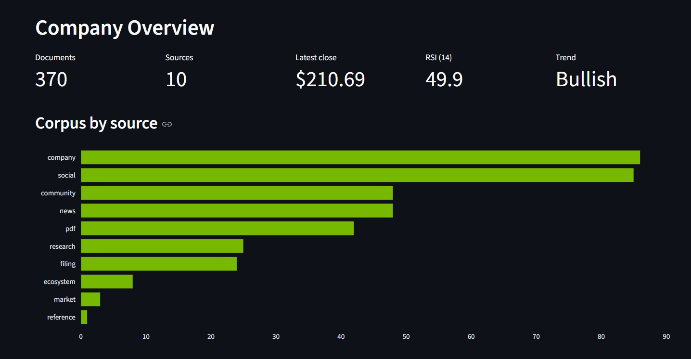
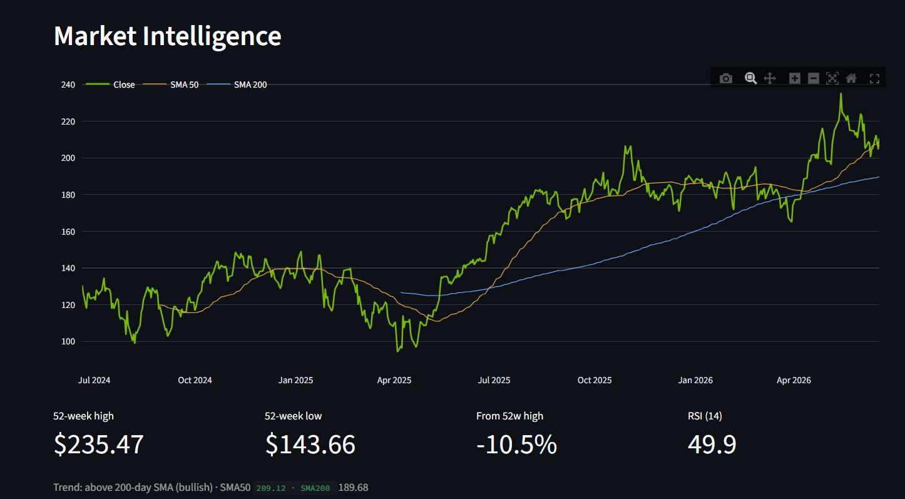
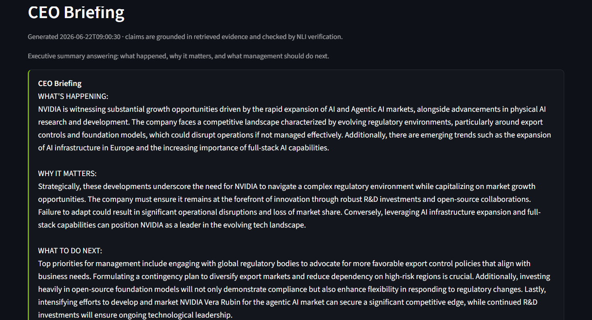
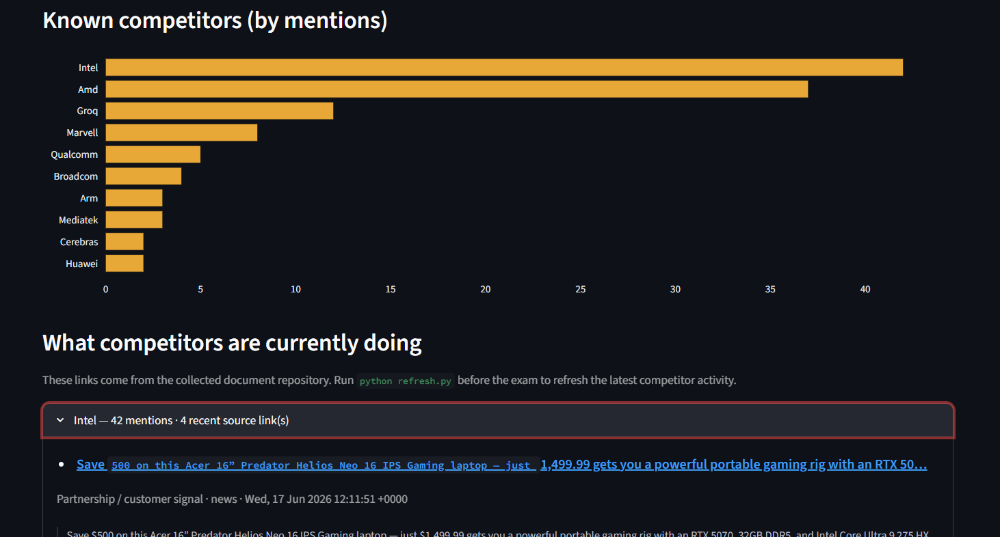
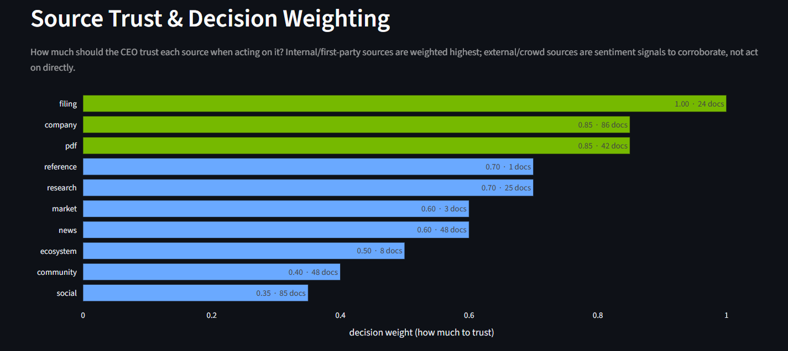
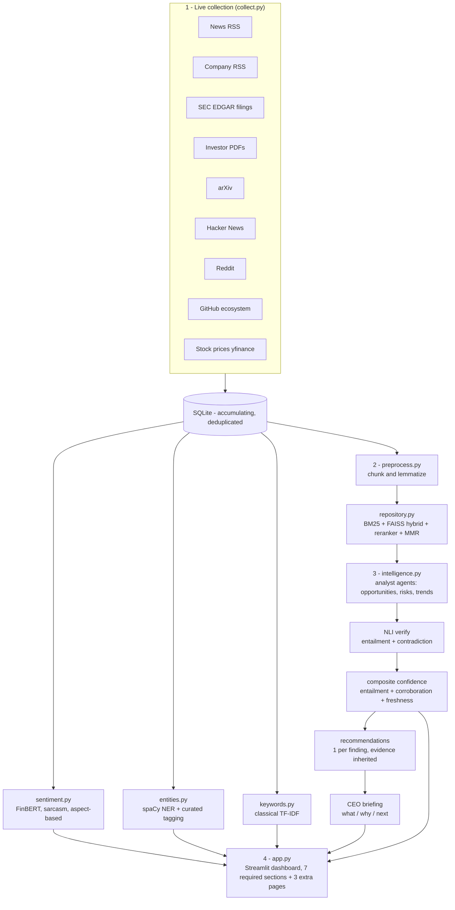

# AI CEO — Strategic Intelligence Agent

An AI strategy consultant for a chosen public company, default: **NVIDIA, NVDA**.

It **collects live public information**, builds a **hybrid retrieval knowledge base**, runs a **multi-agent intelligence engine** for opportunities, risks, and trends, **verifies every claim against its own evidence**, and produces **evidence-based, prioritized recommendations** plus a **CEO briefing** answering:

> *"If you were the CEO today, what would you do next and why?"*

Every component maps to a course module, so the system is fully explainable in the oral exam.
**Constraint honored throughout: open-source / free models only — no paid API, no hosted vector DB.**

---

## Project statistics

| Metric                   | Value                      |
| ------------------------ | -------------------------- |
| Collected documents      | **317**                    |
| Independent source types | **9**                      |
| Chunks indexed           | **XXXX**                   |
| Embedding model          | **BAAI/bge-small-en-v1.5** |
| Vector index             | **FAISS**                  |
| Keyword retriever        | **BM25**                   |
| LLM                      | **Qwen2.5-7B via Ollama**  |
| Last refresh             | **YYYY-MM-DD HH:MM**       |

---

## Executive Intelligence Dashboard Pages

The dashboard follows the exact examination requirement order first.  
The first seven pages directly match the required dashboard sections. Extra analytical pages are placed after the required seven so the evaluator can immediately verify rubric compliance.

### Required pages from the PDF

| Order | Dashboard page | Purpose |
|---:|---|---|
| 1 | **Company Overview** | Displays company name, industry, collected documents, independent source count, and last update timestamp |
| 2 | **Market Intelligence** | Shows stock/market indicators, recent market signals, company activity, and competitor-related intelligence |
| 3 | **Opportunity Monitor** | Displays opportunity title, impact level, supporting evidence, verification status, and confidence score |
| 4 | **Risk Monitor** | Displays risk title, risk category, severity level, supporting evidence, verification status, and confidence score |
| 5 | **Sentiment Analysis** | Shows news sentiment, public sentiment, aspect-based sentiment, sarcasm/irony handling, and sentiment trends |
| 6 | **Strategic Recommendations** | Shows recommendation, priority, supporting evidence, expected impact, and risk level |
| 7 | **CEO Briefing** | Generates an executive summary answering: what happened, why it matters, and what management should do next |

### Extra dashboard pages after the required seven

| Order | Extra page | Purpose |
|---:|---|---|
| 8 | **Competitive Landscape** | Shows competitors by mentions and includes clickable links explaining what competitors are currently doing |
| 9 | **Source Trust** | Shows source reliability, decision weighting, internal vs external evidence, and organization relationship graph |
| 10 | **Ask the Agent** | Allows live evidence-grounded Q&A using the indexed corpus and local LLM |

---

## Dashboard Screenshots

Add screenshots after running the Streamlit dashboard.

Recommended folder structure:

```text
screenshots/
  01_company_overview.png
  02_market_intelligence.png
  03_opportunity_monitor.png
  04_risk_monitor.png
  05_sentiment_analysis.png
  06_strategic_recommendations.png
  07_ceo_briefing.png
  08_competitive_landscape.png
  09_source_trust.png
  10_ask_the_agent.png
```

### 1. Company Overview

![Company Overview]


### 2. Market Intelligence

![Market Intelligence]


### 3. Opportunity Monitor

![Opportunity Monitor]


### 4. Risk Monitor

![Risk Monitor]

### 5. Sentiment Analysis

![Sentiment Analysis]

### 6. Strategic Recommendations

![Strategic Recommendations]
### 7. CEO Briefing

![CEO Briefing]


### 8. Competitive Landscape

![Competitive Landscape]


### 9. Source Trust

![Source Trust]


### 10. Ask the Agent

![Ask the Agent]

---

## System architecture



---

## Data flow

```text
sources --HTTP--> SQLite source of truth --chunk/lemmatize--> BM25 + FAISS index
        |                                                              |
        |                                          embed bge-small-en-v1.5, cosine
        v                                                              v
  uniform record                                        hybrid retrieve -> rerank -> MMR
 {title,text,source,                                                   |
  url,published}                                        LLM reason Qwen2.5-7B local
                                                                       v
                          opportunities / risks / trends -> NLI verify -> score ->
                          recommendations -> CEO briefing -> results JSON -> dashboard
```

---

## Technology stack

| Layer             | Choice                                                                       | Why                                                                                      |
| ----------------- | ---------------------------------------------------------------------------- | ---------------------------------------------------------------------------------------- |
| Collection        | `feedparser`, `requests`, `yfinance`                                         | Free public RSS, JSON, EDGAR APIs, no paid keys                                          |
| Sources           | News, company, filings, PDFs, research, community, social, ecosystem, market | 9 independent source types across the trust spectrum                                     |
| Storage           | **SQLite**                                                                   | Zero-config, portable, accumulating, deduplicated repository                             |
| Embeddings        | **BAAI/bge-small-en-v1.5**                                                   | CPU-friendly 384-dimensional embedding model suitable for semantic retrieval             |
| Vector retrieval  | **FAISS**                                                                    | Fast local vector search without hosted vector database                                  |
| Keyword retrieval | **BM25**                                                                     | Strong lexical baseline for exact terms, company names, tickers, and technical keywords  |
| Hybrid retrieval  | BM25 + FAISS + reranker + MMR                                                | Combines exact keyword matching, semantic similarity, relevance reranking, and diversity |
| Classical NLP     | `spaCy` NER, `sklearn` TF-IDF                                                | Deterministic NLP track for explainability                                               |
| Sentiment         | `ProsusAI/finbert` + irony model + aspect-based sentiment                    | Finance-domain sentiment analysis with sarcasm/irony support                             |
| Reasoning LLM     | **Qwen2.5-7B-Instruct via Ollama**                                           | Open/free local model, no OpenAI/Gemini/Claude API                                       |
| Verifier          | `facebook/bart-large-mnli`                                                   | Independent entailment and contradiction check for evidence grounding                    |
| Knowledge graph   | NetworkX / pyvis                                                             | Lightweight relationship mapping without external services                               |
| Dashboard         | Streamlit + Plotly                                                           | Fast interactive dashboard for executive decision-making                                 |

---

## AI pipeline

1. **Collect**
   Pull live documents from 9 source types into a uniform format and accumulate them in SQLite.

2. **Process**
   Clean documents, remove irrelevant/short content, chunk text, lemmatize, and deduplicate using content hashes.

3. **Index**
   Generate embeddings for chunks using `BAAI/bge-small-en-v1.5`, then build a FAISS dense index and BM25 keyword index.

4. **Retrieve**
   For each analyst lens, combine BM25 and dense retrieval, rerank results, and apply MMR to keep evidence diverse.

5. **Reason**
   Opportunity, risk, and trend agents extract findings using only retrieved evidence.

6. **Verify**
   The NLI verifier checks whether the evidence supports or contradicts each finding using entailment and contradiction scores.

7. **Score**
   Confidence is calculated using a composite score:

   ```text
   confidence = 0.50 * entailment + 0.25 * corroboration + 0.25 * freshness
   ```

   Primary/company sources are not unfairly penalized for age because some official filings remain strategically relevant.

8. **Recommend**
   The system generates one recommendation per ranked finding and carries forward the supporting evidence, confidence, priority, impact, and risk.

9. **Brief**
   The CEO briefing summarizes what happened, why it matters, and what management should do next.

10. **Serve**
    The Streamlit dashboard presents the seven required executive sections first, followed by three extra analytical pages.

---

## Design decisions

### Config-driven company switch

Company identity, source URLs, aliases, keywords, and thresholds live in `config.py`.

Switching from NVIDIA to another company requires:

```text
1. Edit company name, ticker, aliases, and source URLs in config.py
2. Run refresh.py
3. Open the Streamlit dashboard
```

This makes the system suitable for live-coding changes during the oral examination.

---

### Generic-name safety

The company is matched using whole-word aliases such as:

```text
NVDA
NVIDIA
GeForce
CUDA
Jensen Huang
```

This prevents unrelated documents from being kept just because they contain generic terms.

---

### Evidence-first design

Every opportunity, risk, trend, and recommendation carries evidence.
If a finding is weak or unverified, the system should mark it transparently instead of pretending it is certain.

This supports the project goal: not just information retrieval, but strategic decision-making supported by evidence.

---

### Authority-aware trust

The system separates first-party and third-party evidence:

```text
First-party: NVIDIA official announcements, investor relations, SEC filings
Third-party: news, research, community, GitHub, Reddit, Hacker News
```

This allows the dashboard and confidence score to distinguish official evidence from public opinion or external commentary.

---

### Open-source/free LLM only

The project does **not** use OpenAI, Anthropic, Gemini, or any paid commercial LLM API as the primary reasoning engine.

Supported reasoning backends:

```text
1. Ollama locally with Qwen2.5-7B-Instruct
2. In-process transformers on GPU lab machines
```

---

### Dual NLP tracks

The system uses both classical and neural NLP:

| Track         | Components                         | Purpose                                             |
| ------------- | ---------------------------------- | --------------------------------------------------- |
| Classical NLP | TF-IDF, spaCy NER, BM25            | Explainable, deterministic, strong for keywords     |
| Neural NLP    | Embeddings, FinBERT, NLI, Qwen LLM | Semantic search, sentiment, verification, reasoning |

This makes the system easier to explain in the oral exam.

---

## Module map

| Pipeline file     | Task                          | Course area                                |
| ----------------- | ----------------------------- | ------------------------------------------ |
| `collect.py`      | Live data collection          | Data acquisition / APIs                    |
| `database.py`     | Knowledge repository          | Storage and indexing                       |
| `preprocess.py`   | Data processing               | Cleaning, tokenization, lemmatization      |
| `repository.py`   | Retrieval                     | BM25, FAISS, hybrid search, reranking, MMR |
| `sentiment.py`    | Sentiment analysis            | Classification and aspect-based sentiment  |
| `entities.py`     | Named entity recognition      | spaCy NER and curated entity tagging       |
| `keywords.py`     | Keyword extraction            | TF-IDF classical NLP                       |
| `intelligence.py` | Strategic intelligence engine | RAG, agentic reasoning, NLI verification   |
| `llm.py`          | LLM backend                   | Local open-source model serving            |
| `evaluate.py`     | Evaluation                    | Hit@k, MRR, retrieval ablation             |
| `app.py`          | Dashboard                     | Streamlit executive intelligence dashboard |
| `refresh.py`      | Full pipeline runner          | End-to-end orchestration                   |

---

## Run

### One-time setup

```bash
pip install -r requirements.txt
python -m spacy download en_core_web_sm
ollama pull qwen2.5:7b
cp .env.example .env
```

Set `SEC_USER_AGENT` in `.env` using a real email address because SEC EDGAR requires a valid user agent.

Example:

```text
SEC_USER_AGENT=your-name your-email@example.com
```

---

### Full pipeline

```bash
python refresh.py
```

This runs:

```text
collect -> preprocess -> index -> sentiment -> entities -> keywords -> intelligence -> evaluate -> daily_brief
```

---

### Reuse existing FAISS index

```bash
python refresh.py --skip-index
```

This reuses the current FAISS index and avoids rebuilding the index.

---

### Run dashboard

```bash
streamlit run app.py
```

---

## Deliverables

### Deliverable 1: Working Prototype

The working prototype is provided through:

```text
refresh.py
```

It demonstrates:

```text
live collection
storage
retrieval
analysis
recommendation generation
CEO briefing
```

---

### Deliverable 2: Executive Intelligence Dashboard

The dashboard is provided through:

```text
app.py
```

It contains the seven required sections first, exactly in the PDF order:

```text
1. Company Overview
2. Market Intelligence
3. Opportunity Monitor
4. Risk Monitor
5. Sentiment Analysis
6. Strategic Recommendations
7. CEO Briefing
8. Competitive Landscape
9. Source Trust
10. Ask the Agent


---

### Deliverable 3: Architecture Documentation

Architecture documentation is provided through:

```text
README.md
ARCHITECTURE.md
```

It includes:

```text
system architecture diagram
data flow diagram
technology stack
design decisions
AI pipeline
methods
alternatives considered
hyperparameters
```

---


## Evaluation

The project includes retrieval evaluation through:

```text
evaluate.py
```

Evaluation metrics:

| Metric             | Meaning                                                                          |
| ------------------ | -------------------------------------------------------------------------------- |
| Hit@k              | Checks whether a relevant document appears in the top-k retrieved results        |
| MRR                | Mean Reciprocal Rank; rewards relevant documents appearing higher in the ranking |
| Retrieval ablation | Compares BM25, FAISS, and hybrid retrieval performance                           |

---

## Examination focus

In the oral exam, the most important explanation is:

```text
The project is not only summarizing news.
It collects live information, stores it in a searchable knowledge base, retrieves relevant evidence, reasons over it using a local open-source LLM, verifies findings using NLI, and converts the result into CEO-level strategic recommendations.
```

---

## Important note

Weak or unverified findings should not be presented as final CEO recommendations.
Only findings with strong evidence, sufficient confidence, and multiple sources should be promoted to strategic recommendations.

Recommended promotion rule:

```text
verified == true
confidence >= 0.70
citations >= 3
source_types >= 2
```


