# AI CEO — Strategic Intelligence Agent

An AI strategy consultant for a chosen public company, default: **NVIDIA, NVDA**.

It **collects live public information**, builds a **hybrid retrieval knowledge base**, runs a **multi-agent intelligence engine** for opportunities, risks, and trends, **verifies every claim against its own evidence**, and produces **evidence-based, prioritized recommendations** plus a **CEO briefing** answering:

> *"If you were the CEO today, what would you do next and why?"*

Every component maps to a course module, so the system is fully explainable in the oral exam.
**Constraint honored throughout: open-source / free models only — no paid API, no hosted vector DB.**

---

## Project statistics

| Metric                   | Value                      |
| ------------------------ | -------------------------- |
| Collected documents      | **317**                    |
| Independent source types | **9 active** (10 configured, Reddit optional) |
| Chunks indexed           | **7700**                   |
| Embedding model          | **BAAI/bge-small-en-v1.5** |
| Vector index             | **FAISS**                  |
| Keyword retriever        | **BM25**                   |
| LLM                      | **Qwen2.5-7B via Ollama**  |
| Last refresh             | **YYYY-MM-DD HH:MM**       |

---

## Executive Intelligence Dashboard Pages

The dashboard follows the exact examination requirement order first.
The first seven pages directly match the required dashboard sections. Extra analytical pages are placed after the required seven so the evaluator can immediately verify rubric compliance.

### Required pages from the PDF

| Order | Dashboard page | Purpose |
|---:|---|---|
| 1 | **Company Overview** | Displays company name, industry, collected documents, independent source count, and last update timestamp |
| 2 | **Market Intelligence** | Shows stock/market indicators, recent market signals, company activity, and competitor-related intelligence |
| 3 | **Opportunity Monitor** | Displays opportunity title, impact level, supporting evidence, verification status, and confidence score |
| 4 | **Risk Monitor** | Displays risk title, risk category, severity level, supporting evidence, verification status, and confidence score |
| 5 | **Sentiment Analysis** | Shows news sentiment, public sentiment, aspect-based sentiment, sarcasm/irony handling, and sentiment trends |
| 6 | **Strategic Recommendations** | Shows recommendation, priority, supporting evidence, expected impact, risk level, verification status, and number of independent evidence sources |
| 7 | **CEO Briefing** | Generates an executive summary answering: what happened, why it matters, and what management should do next |

### Extra dashboard pages after the required seven

| Order | Extra page | Purpose |
|---:|---|---|
| 8 | **Trend Monitor** | Displays emerging technology and market trends, each with impact level, supporting evidence, verification status, corroboration, and confidence score |
| 9 | **Competitive Landscape** | Shows competitors by mentions and includes clickable links explaining what competitors are currently doing |
| 10 | **Source Trust** | Shows source reliability, decision weighting, internal vs external evidence, and organization relationship graph |
| 11 | **Agent Reasoning** | Allows live evidence-grounded Q&A using the indexed corpus and local LLM |
| 12 | **Ask the Agent** | Allows live evidence-grounded Q&A using the indexed corpus and local LLM |

---

## Dashboard Screenshots


### 1. Company Overview
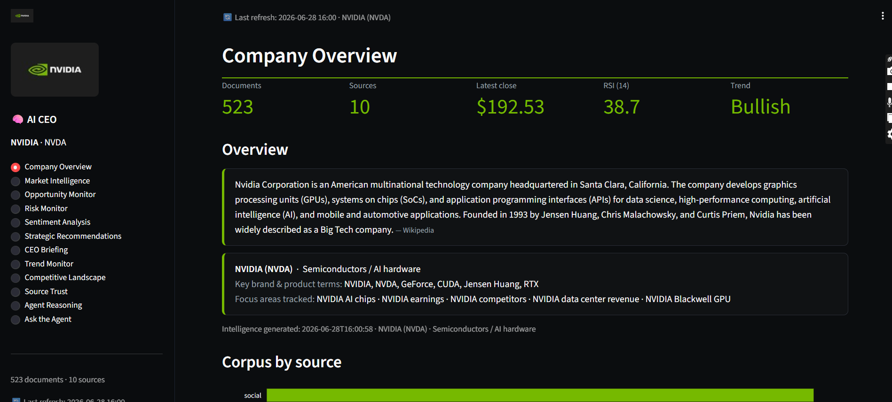

### 2. Market Intelligence
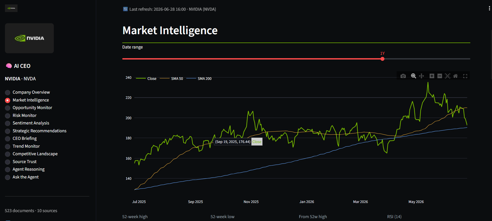

### 3. Opportunity Monitor
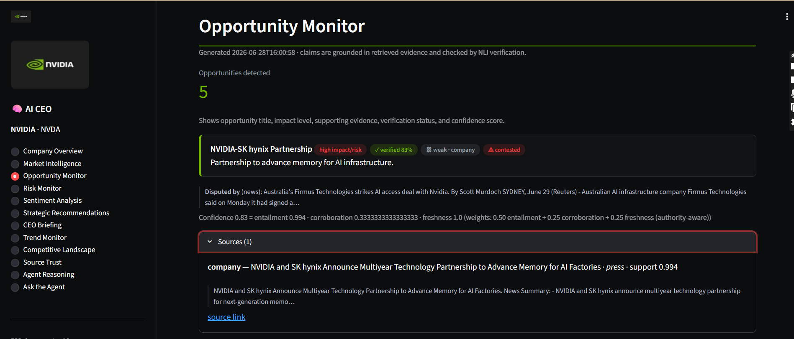

### 4. Risk Monitor
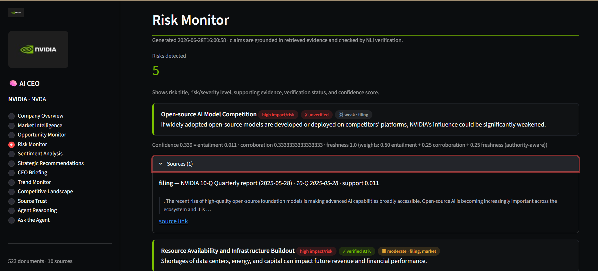

### 5. Sentiment Analysis
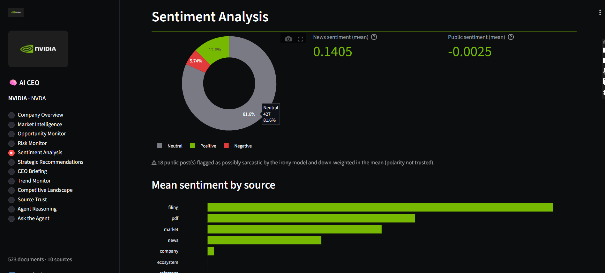

### 6. Strategic Recommendations
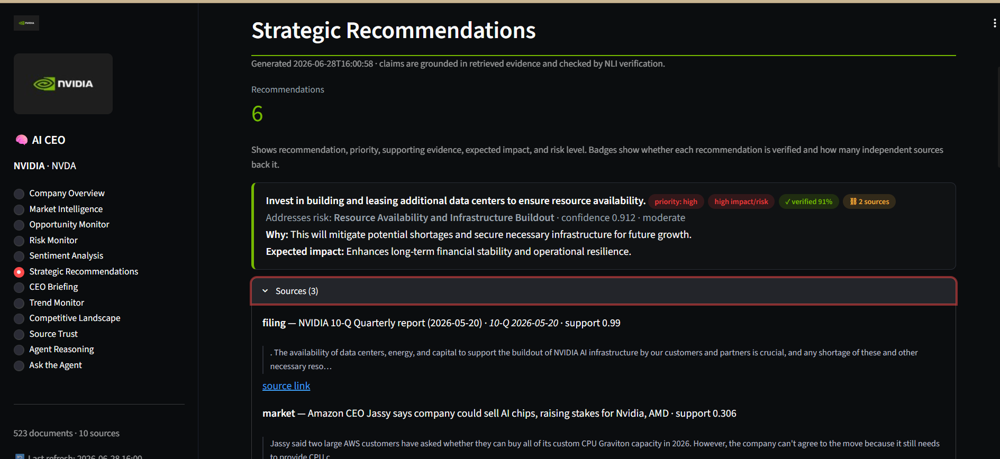

### 7. CEO Briefing
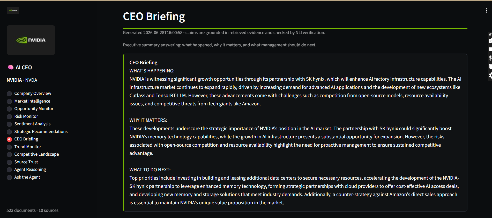

### 8. Trend Monitor
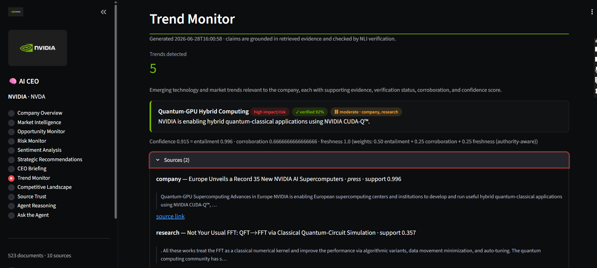

### 9. Competitive Landscape
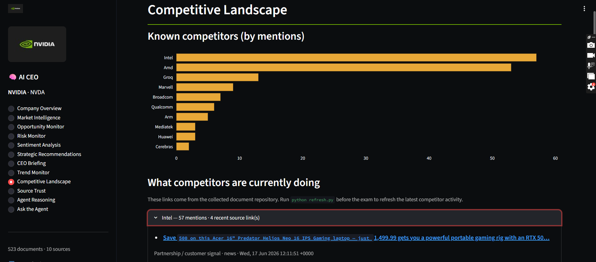

### 10. Source Trust
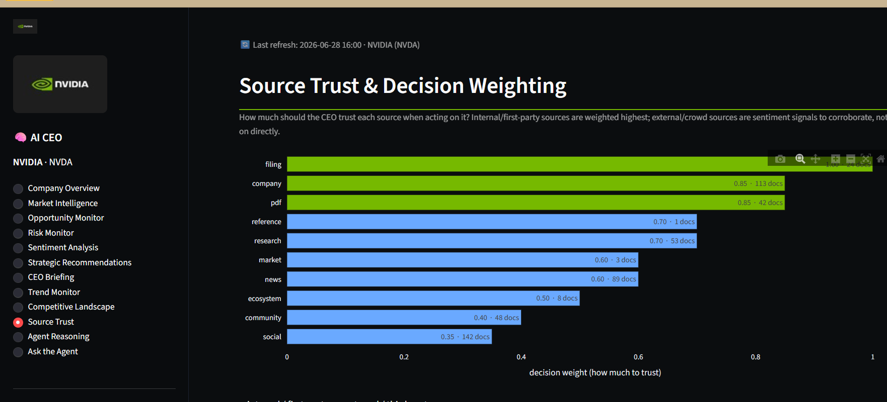

### 11. Agent Reasoning
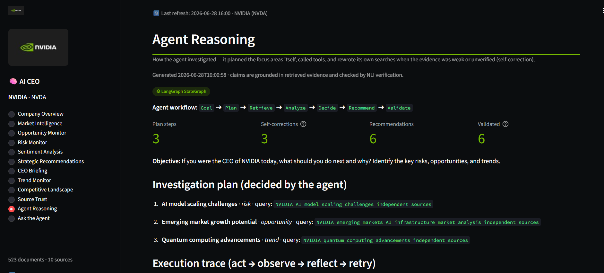

### 12. Ask the Agent
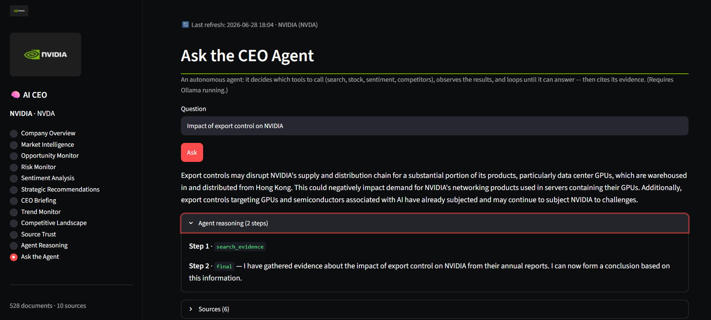

---

## System architecture

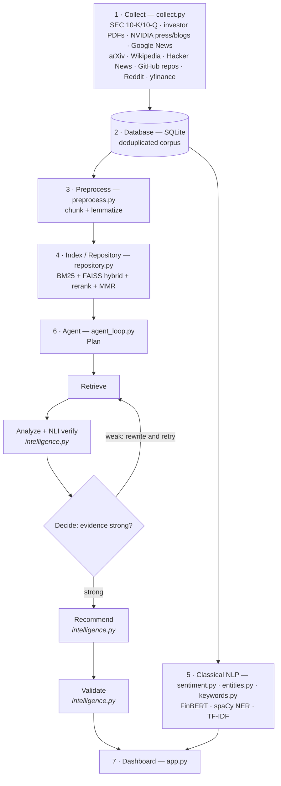

The intelligence stage is a **LangGraph agent** (`agent_loop.py`) running *Plan → Retrieve → Analyze → Decide → Recommend → Validate*; the `Decide` node loops back to `Retrieve` (rewriting its query) when evidence is weak. A second ReAct agent (`agent.py`) powers the interactive "Ask the Agent" page. Both reason with a local Qwen2.5-7B (Ollama) and verify every claim with an NLI model (`bart-large-mnli`).

---

## Data sources

Ten source types are collected (`collect.py`), each tagged with a decision-trust weight
that the dashboard's Source Trust view and the agent's scoring use. Open-web sources are
kept only if they mention an NVIDIA alias; first-party sources are exempt.

| Source type | What is actually collected | Endpoint / query | Trust |
|---|---|---|---|
| `filing` | SEC **10-K + 10-Q** filings, last 2 years | SEC EDGAR (`SEC_FORMS`, `SEC_YEARS=2`) | internal · 1.00 |
| `pdf` | NVIDIA **investor PDFs** — Q4 & Q1 FY2026 results, enterprise reference-architecture white paper | `PDF_URLS` (nvidianews, docs.nvidia.com) | internal · 0.85 |
| `company` | NVIDIA **first-party RSS** — newsroom, corporate blog, developer blog | `nvidianews.nvidia.com/rss.xml`, `blogs.nvidia.com/feed`, `developer.nvidia.com/blog/feed` | internal · 0.85 |
| `research` | **arXiv** papers about NVIDIA (≤15) | `ARXIV_QUERY = abs:NVIDIA` | external · 0.70 |
| `reference` | **Wikipedia** factual background | NVIDIA reference page | external · 0.70 |
| `news` | **Journalism** headlines (≤40/query) | Google News RSS | external · 0.60 |
| `market` | **NVDA price history + indicators**, 2-year window | yfinance (`STOCK_PERIOD = 2y`) | external · 0.60 |
| `ecosystem` | **GitHub repos** — NVIDIA libraries (TensorRT, TensorRT-LLM, CUTLASS, CCCL) + rival stacks (ROCm, Triton, vLLM, llama.cpp) | GitHub API (`GITHUB_REPOS`) | external · 0.50 |
| `community` | **Hacker News** discussion | Algolia (`HN_QUERY = NVIDIA`, 80 hits) | external · 0.40 |
| `social` | **Reddit** retail sentiment — r/nvidia, r/NVDA_Stock, r/wallstreetbets, r/hardware, r/buildapc *(optional, `USE_REDDIT=False` by default; RSS fallback)* | PRAW / Reddit RSS | external · 0.35 |

All ten are defined in `SOURCE_TRUST` (`config.py`), which is the single source of truth for
both collection and the trust weighting. Reddit is off by default, so a standard run uses the
other nine; enable it with the `REDDIT_*` env vars.

## Data flow

```text
INGEST
  sources --HTTP--> SQLite (source of truth)
       uniform record: {title, text, source, url, published}
  SQLite --chunk/lemmatize--> BM25 + FAISS index   (embed bge-small-en-v1.5, cosine)
  SQLite --> classical NLP (sentiment / entities / keywords)

AGENT  (agent_loop.py, LangGraph)
  Plan --> Retrieve --> Analyze --> Decide --> Recommend --> Validate
              |            |           |
       hybrid retrieve   LLM Qwen   evidence weak?
       rerank + MMR      + NLI verify + score
              ^                       |
              +--- rewrite query & retry (Decide loops back to Retrieve) ---+
                                                              | strong
                                                              v
  Validate (NLI-verified gate) --> CEO briefing --> intelligence.json

DASHBOARD
  intelligence.json + classical NLP + SQLite --> app.py (Streamlit)
```

---

## Technology stack

| Layer             | Choice                                                                       | Why                                                                                      |
| ----------------- | ---------------------------------------------------------------------------- | ---------------------------------------------------------------------------------------- |
| Collection        | `feedparser`, `requests`, `yfinance`                                         | Free public RSS, JSON, EDGAR APIs, no paid keys                                          |
| Sources           | SEC filings, investor PDFs, NVIDIA RSS, Google News, arXiv, Wikipedia, market data, GitHub, Hacker News, Reddit (optional) | 10 source types across the trust spectrum (Reddit optional, so 9 active by default) |
| Storage           | **SQLite**                                                                   | Zero-config, portable, accumulating, deduplicated repository                             |
| Embeddings        | **BAAI/bge-small-en-v1.5**                                                   | CPU-friendly 384-dimensional embedding model suitable for semantic retrieval             |
| Vector retrieval  | **FAISS**                                                                    | Fast local vector search without hosted vector database                                  |
| Keyword retrieval | **BM25**                                                                     | Strong lexical baseline for exact terms, company names, tickers, and technical keywords  |
| Hybrid retrieval  | BM25 + FAISS + reranker + MMR                                                | Combines exact keyword matching, semantic similarity, relevance reranking, and diversity |
| Classical NLP     | `spaCy` NER, `sklearn` TF-IDF                                                | Deterministic NLP track for explainability                                               |
| Sentiment         | `ProsusAI/finbert` + irony model + aspect-based sentiment                    | Finance-domain sentiment analysis with sarcasm/irony support                             |
| Reasoning LLM     | **Qwen2.5-7B-Instruct via Ollama**                                           | Open/free local model, no OpenAI/Gemini/Claude API                                       |
| Verifier          | `facebook/bart-large-mnli`                                                   | Independent entailment and contradiction check for evidence grounding                    |
| Knowledge graph   | NetworkX / pyvis                                                             | Lightweight relationship mapping without external services                               |
| Dashboard         | Streamlit + Plotly                                                           | Fast interactive dashboard for executive decision-making                                 |

---

## AI pipeline

1. **Collect**
   Pull live documents from up to 10 source types (Reddit optional) into a uniform format and accumulate them in SQLite.

2. **Process**
   Clean documents, remove irrelevant/short content, chunk text, lemmatize, and deduplicate using content hashes.

3. **Index**
   Generate embeddings for chunks using `BAAI/bge-small-en-v1.5`, then build a FAISS dense index and BM25 keyword index.

4. **Retrieve**
   For each analyst lens, combine BM25 and dense retrieval, rerank results, and apply MMR to keep evidence diverse. The intelligence engine gathers a **source-balanced** evidence pool (top chunks from each source type) so findings can be corroborated across *independent* sources rather than being dominated by one source such as long filings or PDFs.

5. **Reason**
   Opportunity, risk, and trend agents extract findings using only retrieved evidence.

6. **Verify**
   The NLI verifier checks whether the evidence supports or contradicts each finding using entailment and contradiction scores. Verification is sentence-level, so a claim is supported when any single evidence sentence entails it.

7. **Score**
   Confidence is calculated using a composite score:

   ```text
   confidence = 0.50 * entailment + 0.25 * corroboration + 0.25 * freshness
   ```

   Primary/company sources are not unfairly penalized for age because some official filings remain strategically relevant. Citations are diversified across source types, so corroboration reflects how many *independent* sources support a finding.

8. **Recommend**
   The system generates one recommendation per ranked finding and carries forward the supporting evidence, confidence, priority, impact, and risk. Findings are ranked so verified, well-corroborated, high-confidence ones surface first; each recommendation records whether it is verified and how many independent evidence sources back it.

9. **Brief**
   The CEO briefing summarizes what happened, why it matters, and what management should do next.

10. **Serve**
    The Streamlit dashboard presents the seven required executive sections first, followed by four extra analytical pages (Trend Monitor, Competitive Landscape, Source Trust, Ask the Agent).

---

## Design decisions

### Config-driven company switch

Company identity, source URLs, aliases, keywords, and thresholds live in `config.py`.

Switching from NVIDIA to another company requires:

```text
1. Edit company name, ticker, aliases, and source URLs in config.py
2. Run refresh.py
3. Open the Streamlit dashboard
```

This makes the system suitable for live-coding changes during the oral examination.

---

### Generic-name safety

The company is matched using whole-word aliases such as:

```text
NVDA
NVIDIA
GeForce
CUDA
Jensen Huang
```

This prevents unrelated documents from being kept just because they contain generic terms.

---

### Evidence-first design

Every opportunity, risk, trend, and recommendation carries evidence.
If a finding is weak or unverified, the system marks it transparently instead of pretending it is certain. Evidence is always shown — if no citation clears the verification bar, the cited evidence is still displayed (flagged unverified, with its support score) rather than hidden.

This supports the project goal: not just information retrieval, but strategic decision-making supported by evidence.

---

### Source-balanced evidence gathering

For each analyst lens the engine retrieves the top chunks from **each** source type separately and combines them, instead of taking the global top-k (which long filings and PDFs tend to dominate). When building a finding's citations it keeps the strongest entailing chunk from each distinct source first. This is what lets a finding be corroborated across, for example, *filing + news + market* rather than *pdf + pdf + pdf*, and it drives the cross-source corroboration score.

---

### Authority-aware trust

The system separates first-party and third-party evidence:

```text
First-party: NVIDIA official announcements, investor relations, SEC filings
Third-party: news, research, community, GitHub, Reddit, Hacker News
```

This allows the dashboard and confidence score to distinguish official evidence from public opinion or external commentary.

---

### Open-source/free LLM only

The project does **not** use OpenAI, Anthropic, Gemini, or any paid commercial LLM API as the primary reasoning engine.

Supported reasoning backends:

```text
1. Ollama locally with Qwen2.5-7B-Instruct
2. In-process transformers on GPU lab machines
```

---

### Dual NLP tracks

The system uses both classical and neural NLP:

| Track         | Components                         | Purpose                                             |
| ------------- | ---------------------------------- | --------------------------------------------------- |
| Classical NLP | TF-IDF, spaCy NER, BM25            | Explainable, deterministic, strong for keywords     |
| Neural NLP    | Embeddings, FinBERT, NLI, Qwen LLM | Semantic search, sentiment, verification, reasoning |

This makes the system easier to explain in the oral exam.

---

## Module map

| Pipeline file     | Task                          | Course area                                |
| ----------------- | ----------------------------- | ------------------------------------------ |
| `collect.py`      | Live data collection          | Data acquisition / APIs                    |
| `database.py`     | Knowledge repository          | Storage and indexing                       |
| `preprocess.py`   | Data processing               | Cleaning, tokenization, lemmatization      |
| `repository.py`   | Retrieval                     | BM25, FAISS, hybrid search, reranking, MMR |
| `sentiment.py`    | Sentiment analysis            | Classification and aspect-based sentiment  |
| `entities.py`     | Named entity recognition      | spaCy NER and curated entity tagging       |
| `keywords.py`     | Keyword extraction            | TF-IDF classical NLP                       |
| `intelligence.py` | Strategic intelligence engine | RAG, agentic reasoning, NLI verification   |
| `llm.py`          | LLM backend                   | Local open-source model serving            |
| `evaluate.py`     | Evaluation                    | Hit@k, MRR, retrieval ablation             |
| `app.py`          | Dashboard                     | Streamlit executive intelligence dashboard |
| `refresh.py`      | Full pipeline runner          | End-to-end orchestration                   |

---

## Run

### One-time setup

```bash
pip install -r requirements.txt
python -m spacy download en_core_web_sm
ollama pull qwen2.5:7b
cp .env.example .env
```

Set `SEC_USER_AGENT` in `.env` using a real email address because SEC EDGAR requires a valid user agent.

---

### Full pipeline

```bash
python refresh.py
```

This runs:

```text
collect -> preprocess -> index -> sentiment -> entities -> keywords -> intelligence -> evaluate -> daily_brief
```

---

### Reuse existing FAISS index

```bash
python refresh.py --skip-index
```

This reuses the current FAISS index and avoids rebuilding the index.

---

### Run dashboard

```bash
streamlit run app.py
```

The dashboard loads from pre-computed artifacts and auto-refreshes when they change (each cached loader keys on the file's modification time), so regenerating the intelligence output is reflected without manually clearing the cache.

---

## Deliverables

### Deliverable 1: Working Prototype

The working prototype is provided through:

```text
refresh.py
```

It demonstrates:

```text
live collection
storage
retrieval
analysis
recommendation generation
CEO briefing
```

---

### Deliverable 2: Executive Intelligence Dashboard

The dashboard is provided through:

```text
app.py
```

It contains the seven required sections first, exactly in the PDF order, followed by four extra analytical pages:

```text
1. Company Overview
2. Market Intelligence
3. Opportunity Monitor
4. Risk Monitor
5. Sentiment Analysis
6. Strategic Recommendations
7. CEO Briefing
8. Trend Monitor
9. Competitive Landscape
10. Source Trust
11. Agent Reasoning
12. Ask the Agent
```

---

### Deliverable 3: Architecture Documentation

Architecture documentation is provided through:

```text
README.md
ARCHITECTURE.md
LAYERS.md
```

It includes:

```text
system architecture diagram
data flow diagram
technology stack
design decisions
AI pipeline
methods
alternatives considered
hyperparameters
per-layer mechanism and hyperparameter sensitivity
```

---

## Evaluation

The project includes retrieval evaluation through:

```text
evaluate.py
```

Evaluation metrics:

| Metric             | Meaning                                                                          |
| ------------------ | -------------------------------------------------------------------------------- |
| Hit@k              | Checks whether a relevant document appears in the top-k retrieved results        |
| MRR                | Mean Reciprocal Rank; rewards relevant documents appearing higher in the ranking |
| Retrieval ablation | Compares BM25, FAISS, and hybrid retrieval performance                           |

---

## Examination focus

In the oral exam, the most important explanation is:

```text
The project is not only summarizing news.
It collects live information, stores it in a searchable knowledge base, retrieves relevant evidence, reasons over it using a local open-source LLM, verifies findings using NLI, and converts the result into CEO-level strategic recommendations.
```

---

## Important note

Unverified findings should not be presented as validated CEO recommendations.

Validation is performed by an independent NLI model: a recommendation is marked **validated**
only when its underlying claim is *entailed* by the retrieved evidence (anti-hallucination).
The number of independent sources that corroborate it is reported separately as a secondary
quality signal — shown on every recommendation, but not required for validation, because a
strong single-source claim from an authoritative filing can still be correct.

The dashboard makes this visible: each recommendation shows whether it is **verified** (the
validation gate) and how many **independent sources** corroborate it (the secondary signal),
and findings are ranked so verified, well-corroborated, high-confidence ones surface first.

Validation gate:

```text
validated  ==  verified            # NLI: the claim is entailed by its evidence
reported   :=  evidence_sources    # how many independent source types corroborate it
               corroboration       # strong (3+) / moderate (2) / weak (1)
```