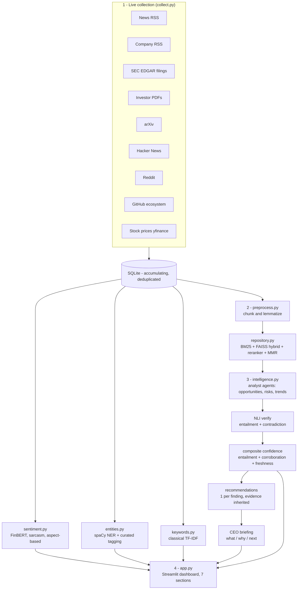

# AI CEO — Strategic Intelligence Agent

An AI strategy consultant for a chosen public company (default: **NVIDIA, NVDA**).
It **collects live public information**, builds a **hybrid retrieval knowledge base**, runs a
**multi-agent intelligence engine** (opportunities / risks / trends), **verifies every claim
against its own evidence**, and produces **evidence-based, prioritized recommendations** plus a
**CEO briefing** answering:

> *"If you were the CEO today, what would you do next and why?"*

Every component maps to a course module (see [Module map](#module-map)), so the system is fully
explainable in the oral exam. **Constraint honored throughout: open-source / free models only —
no paid API, no hosted vector DB.**

---

## System architecture



## Data flow

```
sources --HTTP--> SQLite (source of truth) --chunk/lemmatize--> BM25 + FAISS index
        |                                                              |
        |                                          embed (bge-small-en-v1.5, cosine)
        v                                                              v
  uniform record                                        hybrid retrieve -> rerank -> MMR
 {title,text,source,                                                   |
  url,published}                                        LLM reason (Qwen2.5-7B, local)
                                                                       v
                          opportunities / risks / trends -> NLI verify -> score ->
                          recommendations -> CEO briefing -> results JSON -> dashboard
```

## Technology stack

| Layer | Choice | Why |
|---|---|---|
| Collection | `feedparser`, `requests`, `yfinance` | free public RSS / JSON / EDGAR APIs, no keys |
| Sources (>=3 required) | News, Company, Filings, PDFs, Research, Community, Social, Ecosystem, Market | 9 independent source types across the trust spectrum |
| Storage | **SQLite** (accumulating, deduplicated) | zero-config, portable, enables daily change-diff |
| Embeddings | `BAAI/bge-small-en-v1.5` (384-d) | top MTEB retrieval per size, CPU-friendly |
| Retrieval | **Hybrid** BM25 (`rank_bm25`) + dense FAISS, cross-encoder rerank, MMR | beats either method alone (see eval) |
| Similarity | cosine via `IndexFlatIP` + L2-normalize | exact, perfect recall at ~7.5k chunks |
| Classical NLP | `spaCy` NER, `sklearn` TF-IDF | deterministic track alongside the neural one |
| Sentiment | `ProsusAI/finbert` + irony model + aspect-based | finance-domain accuracy, sarcasm-aware |
| Reasoning LLM | **Qwen2.5-7B-Instruct** - Ollama (laptop) or in-process transformers (GPU lab) | open/free only - **no paid API** |
| Verifier | `facebook/bart-large-mnli`, sentence-level entailment + contradiction | independent grounding check |
| Knowledge graph | NetworkX / pyvis (in-memory) | no live-server risk in the oral |
| Dashboard | Streamlit + Plotly | fastest path to a multi-section analytical UI |

## AI pipeline

1. **Collect** - pull live docs from 9 source types into a uniform shape; accumulate in SQLite.
2. **Process** - clean, drop short/irrelevant docs, chunk (1000/150), lemmatize; dedup by content hash.
3. **Index** - embed each chunk; build a BM25 + FAISS hybrid retriever with a reranker and MMR.
4. **Retrieve** - per analyst lens, fuse BM25 + dense (`alpha=0.5`), rerank, diversify -> cited evidence.
5. **Reason** - Opportunity / Risk / Trend agents extract findings grounded *only* in retrieved evidence.
6. **Verify** - an NLI model scores entailment (support) and contradiction (dispute) per finding,
   at sentence level; contested findings are flagged.
7. **Score** - composite confidence = `0.50*entailment + 0.25*corroboration + 0.25*freshness`
   (freshness is authority-aware: primary sources are not penalized for age).
8. **Recommend** - one recommendation per ranked finding, inheriting its citations and confidence,
   with a priority score.
9. **Brief** - synthesize a CEO briefing: *what's happening / why it matters / what to do next*.
10. **Serve** - Streamlit dashboard (7 sections) + live "Ask the Agent" Q&A.

## Design decisions

- **Config-driven company switch.** Company identity, sources, and all thresholds live in
  `config.py`. Switching company = edit that file + rerun. Built for live-coding changes.
- **Generic-name safety.** The company is matched as whole-word aliases (`NVDA`, `GeForce`,
  `Jensen Huang`, ...) so the relevance filter never keeps unrelated text.
- **Evidence-first, never hidden.** Every finding and recommendation carries cited evidence with a
  per-source support score; if nothing clears the verification bar, the evidence is still shown
  (marked unverified) rather than dropped - transparency over false precision.
- **Authority-aware trust.** Sources are weighted internal/first-party vs external/third-party; the
  same weighting drives both the confidence score and the dashboard's decision-strategy view.
- **Open-source LLM only**, two interchangeable backends: Ollama locally, in-process transformers on
  the GPU lab. Never depends on a paid API.
- **Dual NLP tracks.** A classical track (TF-IDF, spaCy NER) runs alongside the neural track
  (embeddings, FinBERT, NLI, LLM) so results can be cross-checked.

## Module map

| Pipeline file | Task | Course area |
|---|---|---|
| `collect.py` | 1 Live collection | data acquisition / APIs |
| `database.py` | 2 Knowledge repository | storage / indexing |
| `preprocess.py` | 3 Processing | tokenization, lemmatization |
| `repository.py` | retrieval | hybrid search, reranking, MMR |
| `sentiment.py` | sentiment / ABSA | classification, aspect-based sentiment |
| `entities.py` | NER | named-entity recognition |
| `keywords.py` | classical NLP | TF-IDF term extraction |
| `intelligence.py` | 4 Intelligence + 5/6 Recommendations | RAG, NLI verification, agents |
| `llm.py` | reasoning backend | local LLM serving |
| `evaluate.py` | evaluation | retrieval metrics (Hit@k, MRR) |
| `app.py` | Deliverable 2 | Streamlit dashboard |

## Run

One-time setup:

```bash
pip install -r requirements.txt
python -m spacy download en_core_web_sm
ollama pull qwen2.5:7b          # laptop;  OR on the GPU lab:  export LLM_BACKEND=transformers
cp .env.example .env            # set SEC_USER_AGENT to a real email (required)
```

Full pipeline (one command):

```bash
python refresh.py               # collect -> preprocess -> index -> sentiment -> entities ->
                                # keywords -> intelligence -> evaluate -> daily_brief
python refresh.py --skip-index  # reuse the existing FAISS index (skip the ~40-min rebuild)
```

Run the dashboard:

```bash
streamlit run app.py
```

## Deliverables

- **Working prototype** - the full pipeline above (`refresh.py`).
- **Streamlit dashboard** - `app.py`, 7 sections: overview, market, sentiment, competitive
  landscape, CEO intelligence (with briefing + cited findings + recommendations), source trust,
  ask-the-agent.
- **Architecture document** - `ARCHITECTURE.md` (methods, alternatives, hyperparameters).
- **Evaluation** - `evaluate.py` retrieval ablation (Hit@k, MRR).

See `ARCHITECTURE.md` for the full design rationale, alternatives considered, and hyperparameters.
