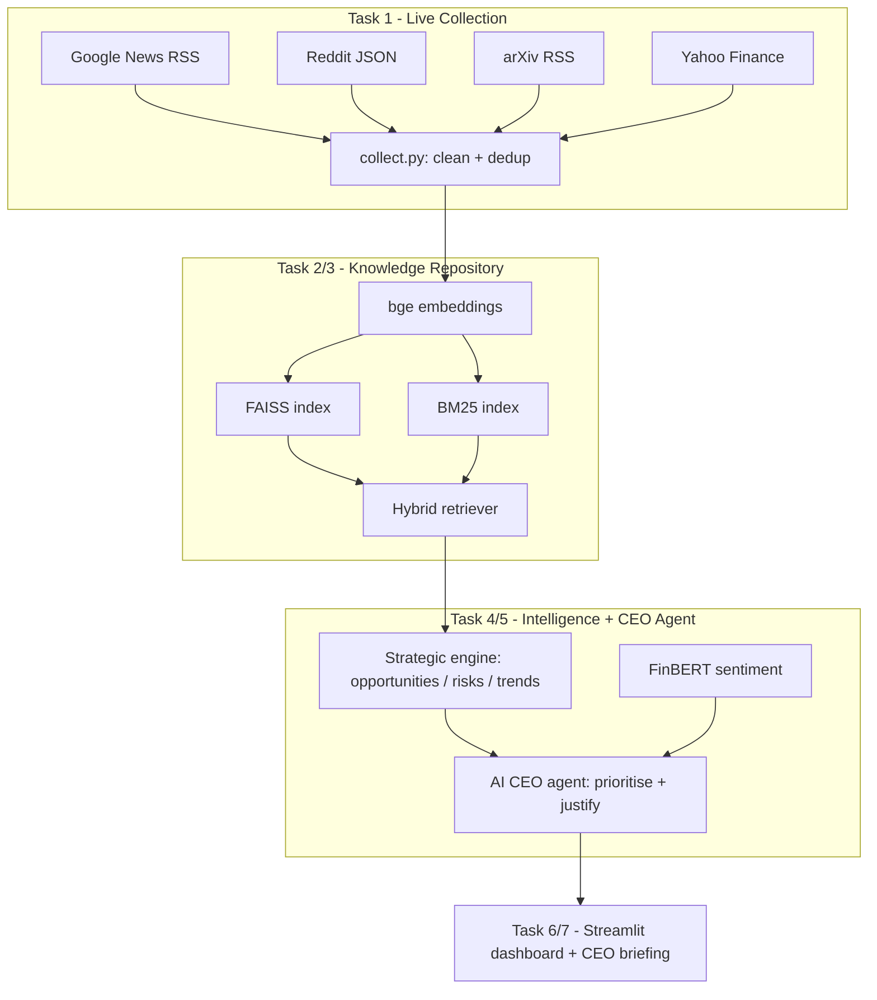
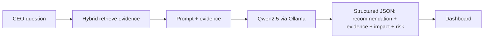

# AI CEO — Strategic Intelligence Agent

An AI advisor that continuously collects live information about a target company,
reasons over it, and produces evidence-based executive recommendations — answering:
**"If you were the CEO today, what would you do next, and why?"**

> Built on the six-phase NLP pipeline: **counts → meaning → memory → focus → facts → action.**

---

## Technology Stack

| Layer | Tool | Role |
|---|---|---|
| LLM (reasoning) | **Ollama + Qwen2.5-7B** (open-source, local) | AI CEO agent, recommendations |
| Embeddings | **BAAI/bge-small-en-v1.5** | semantic vectors |
| Vector store | **FAISS** | dense retrieval |
| Keyword retrieval | **BM25 (rank-bm25)** | sparse retrieval |
| Retrieval strategy | **Hybrid (BM25 + FAISS via EnsembleRetriever)** | grounding evidence |
| Sentiment | **ProsusAI/FinBERT** | finance-tuned sentiment |
| Orchestration | **LangChain (LCEL chains)** | prompt → llm → parser |
| Data collection | **feedparser, requests, yfinance** | 4 key-free sources |
| Dashboard | **Streamlit + Plotly** | executive UI |

All models are open-source / freely accessible. **No commercial LLM API is used.**

---

## System Architecture



## Data Flow



Every recommendation carries its **supporting evidence (source URLs)**, an
**expected impact**, and a **risk assessment** — so nothing the agent says is ungrounded.

---

## Project Structure

```
ai_ceo/
├── config.py              # company + model settings (swap company in 1 place)
├── requirements.txt
├── src/
│   ├── collect.py         # [DONE]  Task 1 + 3: collect, clean, dedup
│   ├── repository.py      # [Day 2] Task 2: embeddings, FAISS, BM25, hybrid retriever
│   ├── sentiment.py       # [Day 2] Task 5 input: FinBERT
│   ├── engine.py          # [Day 3] Task 4: opportunities / risks / trends
│   └── ceo_agent.py       # [Day 3] Task 5/6: reason, prioritise, justify
├── app.py                 # [Day 4] Task 6/7: Streamlit dashboard (7 sections)
├── data/
│   ├── raw/               # untouched pull (audit trail)
│   └── clean/             # cleaned + de-duplicated docs + company profile
└── storage/               # FAISS index
```

---

## Setup

```bash
# 1. Install dependencies
pip install -r requirements.txt

# 2. Install the local LLM (open-source, no key)
#    Download Ollama from ollama.com, then:
ollama pull qwen2.5:7b        # or qwen2.5:3b on a weaker laptop

# 3. Collect live data (Day 1)
python -m src.collect

# 4. (Day 4) Launch the dashboard
streamlit run app.py
```

To analyse a different company, edit only the `COMPANY` block in `config.py`.

---

## Design Decisions

- **Hybrid retrieval (BM25 + FAISS).** Dense vectors catch meaning; BM25 catches exact
  names/tickers. Combining them improves evidence recall for a domain full of proper nouns.
- **Local open-source LLM (Ollama).** Fully compliant with the brief, reproducible, and no
  rate limits during the demo.
- **FinBERT over generic sentiment.** Finance-tuned model reads market/news tone correctly.
- **Structured-output prompting.** The CEO agent returns JSON, so every recommendation is
  forced to include evidence, impact, and risk — no ungrounded advice.

---

## AI Pipeline (phase mapping)

| Phase | Concept | Where in this project |
|---|---|---|
| counts | BM25 / keyword | `repository.py` |
| meaning | embeddings | `repository.py` (bge) |
| memory | vector store | FAISS index |
| focus | retrieval | hybrid retriever |
| facts | RAG grounding | `ceo_agent.py` evidence |
| action | agent reasoning | `ceo_agent.py` recommendations |
